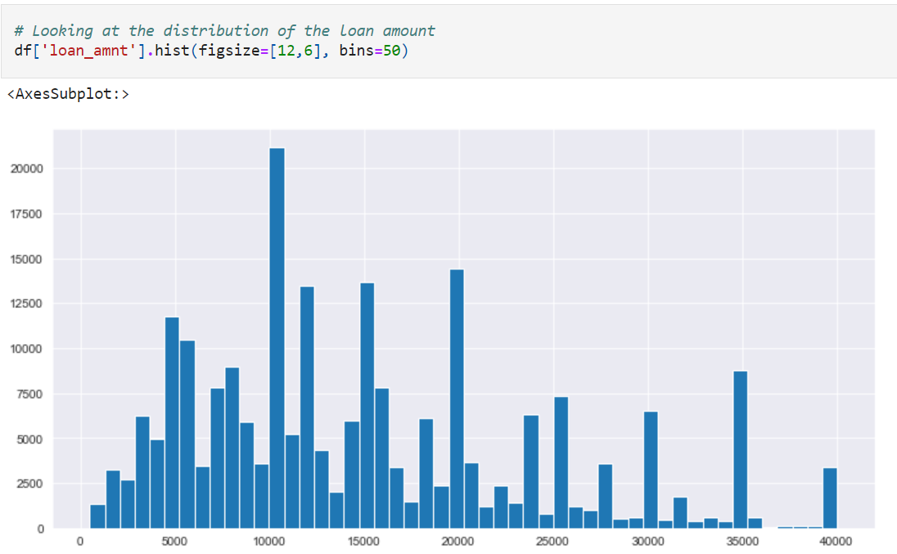
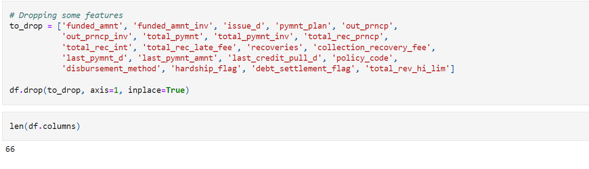
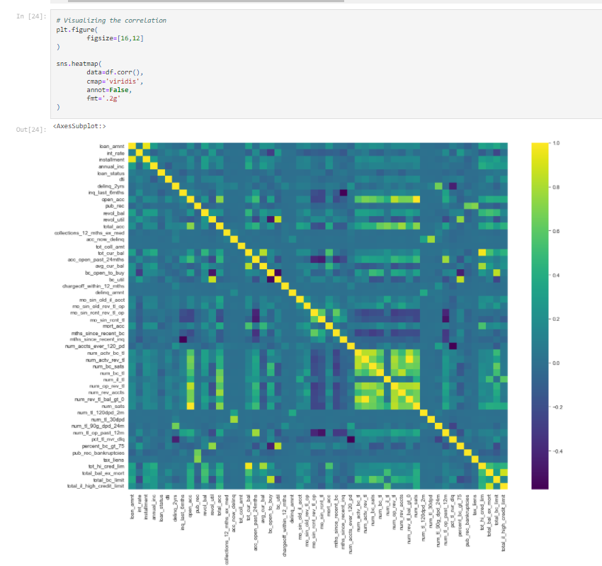
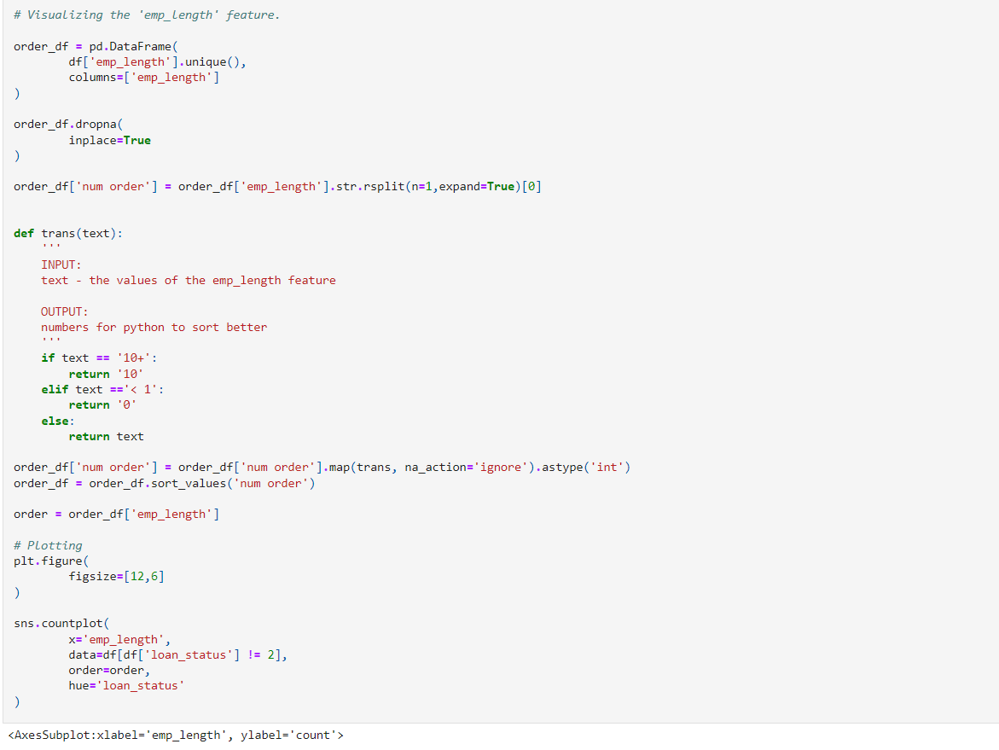
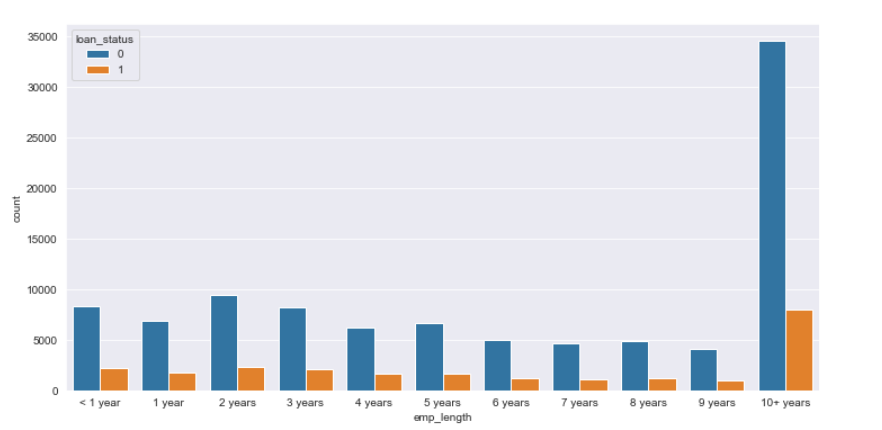
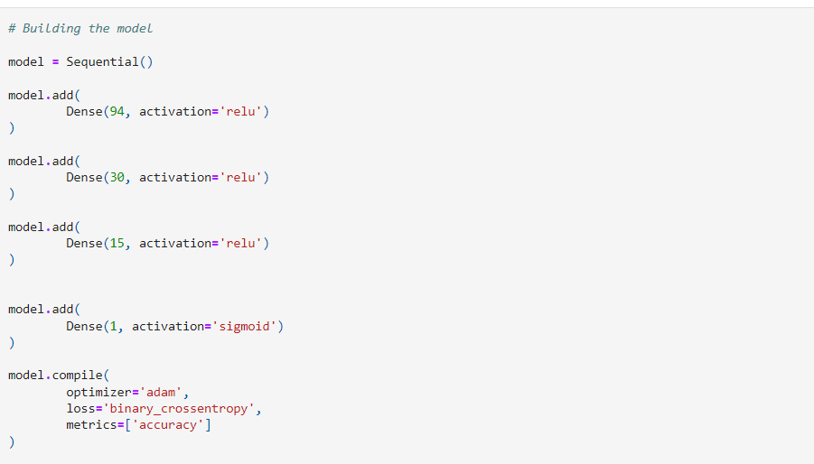
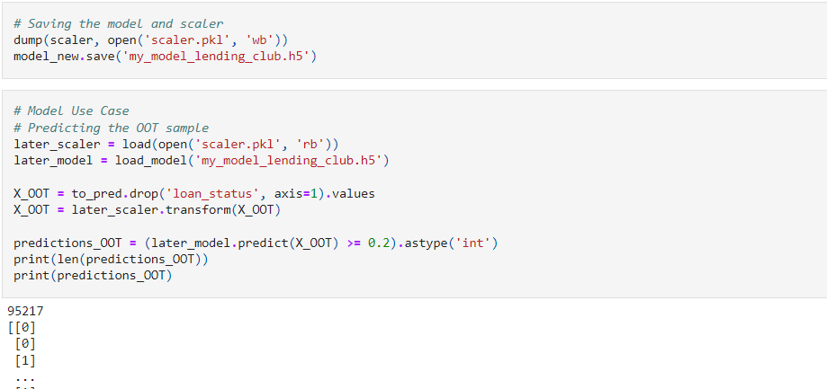

## Loan DataSet Analysis

### Project Overview

Data:

Dataset obtained from Kaggle.com: https://www.kaggle.com/adarshsng/lending-club-loan-data-csv/version/1

The CSV file contains complete loan data for all loans issued through the 2007-2018, including the current loan status (Current, Late, Fully Paid, etc.) and latest payment information. Additional features include credit scores, number of finance inquiries, address including zip codes, and state, and collections among others.

### Problem Statement

Among all the loans there is always a good portion of them that eventually turn out to be bad loans. Our goal for this project is, by leveraging the historical data of granted loans with information on whether or not the borrower defaulted, to build a model which can predict whether or nor a borrower will pay back the loan. So we may take the result coming out of this tool into consideration, when they are in determination of whether to approve a loan application from a new customer.

Because the data input contains a great number of features in various types, making the input very complex, we decided to skip the conventional regression methods for modeling. Instead, I'll use Neural Networks with multiple hidden layers, A.K.A Deep Learning.

# OUTPUTS

1. Plotting the distribution of the loan amount.

   

2. Dropping some of the features

   

3. Visualizing the corelation

   

4. Exploring the good/bad loan.

   

5. Visualizing the emp_length feature

   

6. Plot

   

7. Building a model

   

8. Saving the model

   
